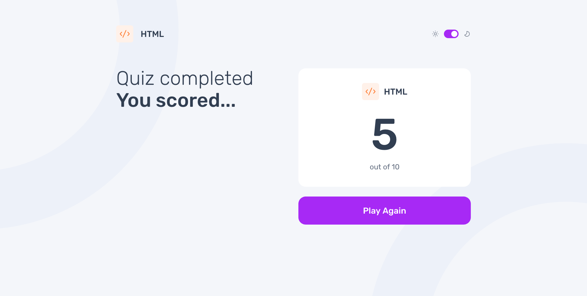

# Frontend Mentor - Frontend quiz app solution

This is a solution to the [Frontend quiz app challenge on Frontend Mentor](https://www.frontendmentor.io/challenges/frontend-quiz-app-BE7xkzXQnU). Frontend Mentor challenges help you improve your coding skills by building realistic projects.

## Table of contents

- [Overview](#overview)
  - [The challenge](#the-challenge)
  - [Screenshot](#screenshot)
  - [Links](#links)
- [My process](#my-process)
  - [Built with](#built-with)
  - [What I learned](#what-i-learned)
  - [Continued development](#continued-development)
  - [Useful resources](#useful-resources)
- [Author](#author)

## Overview

### The challenge

Users should be able to:

- Select a quiz subject
- Select a single answer from each question from a choice of four
- See an error message when trying to submit an answer without making a selection
- See if they have made a correct or incorrect choice when they submit an answer
- Move on to the next question after seeing the question result
- See a completed state with the score after the final question
- Play again to choose another subject
- View the optimal layout for the interface depending on their device's screen size
- See hover and focus states for all interactive elements on the page
- Navigate the entire app only using their keyboard
- Change the app's theme between light and dark

### Screenshot




### Links

- Solution URL: [https://github.com/srijanss/frontend-quiz-app/](https://github.com/srijanss/frontend-quiz-app/)
- Live Site URL: [https://srijanss.github.io/frontend-quiz-app/](https://srijanss.github.io/frontend-quiz-app/)

## My process

### Built with

- Semantic HTML5 markup
- CSS custom properties
- Flexbox
- CSS Grid
- Mobile-first workflow
- [Vite](https://vitejs.dev/) - Lightweight frontend tooling
- [PostCSS](https://postcss.org/) - Tool to transform CSS using plugins

### What I learned

Built this app using basic routing based on Regex filtering and history API based state management. Try to make routing work with SPA without using any libraries.

```js
const routes = {
  "/": { component: CategoryPage, name: "home-page" },
  ":category/question/:id/": { component: QuestionPage, name: "question-page" },
  ":category/score/": { component: ScorePage, name: "score-page" },
};

function matchRoute(path) {
  const matchedRoute = routes["/"].component;
  for (const route in routes) {
    const re = new RegExp(`^${route.replace(/:\w+/g, "([^/]+)")}$`);
    path = path.length > 1 ? path.replace(/^\//, "") : path;
    if (!path.endsWith("/")) {
      path += "/";
    }
    const match = path.match(re);
    if (match) {
      matchedRoute.component = routes[route].component;
      const params = match.slice(1);
      if (params.length > 0) {
        matchedRoute.params = params;
      }
      return matchedRoute;
    }
  }
  return matchedRoute;
}
```

```js
export function navigateTo(path, state) {
  const newPath = path.includes(store.baseURL) ? path : store.baseURL + path;
  window.history.pushState(state || {}, "", newPath);
  render();
}

export function navigateByReplace(path, state) {
  const newPath = path.includes(store.baseURL) ? path : store.baseURL + path;
  window.history.replaceState(state || {}, "", newPath);
  render();
}

export function replaceState(path, state) {
  const newPath = path.includes(store.baseURL) ? path : store.baseURL + path;
  window.history.replaceState(state || {}, "", newPath);
}

export function handleHistoryPopState() {
  window.onpopstate = render;
}
```

There were many challenges to build this multipage app using SPA, and without any routing libraries or fullstack framework. Like when you refresh a page on any URL except the root URL, then it will redirect back to root page.

### Continued development

As a challenge I tried to develop this app without any framework. But in future I will try to build this again with Remix and SvelteKit. It will be fun task.

### Useful resources

- [Web components - Custom State Set](https://developer.mozilla.org/en-US/docs/Web/API/CustomStateSet#browser_compatibility) - Very helpful resource about CustomStateSet in web components.
- [History API](https://developer.mozilla.org/en-US/docs/Web/API/History) - Very helpful to understand how history stack works. And how to maintain persistent data using history state.

## Author

- Website - [Srijan Manandhar](https://github.com/srijanss)
- Frontend Mentor - [@srijanss](https://www.frontendmentor.io/profile/srijanss)
